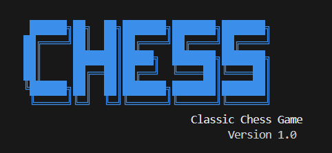
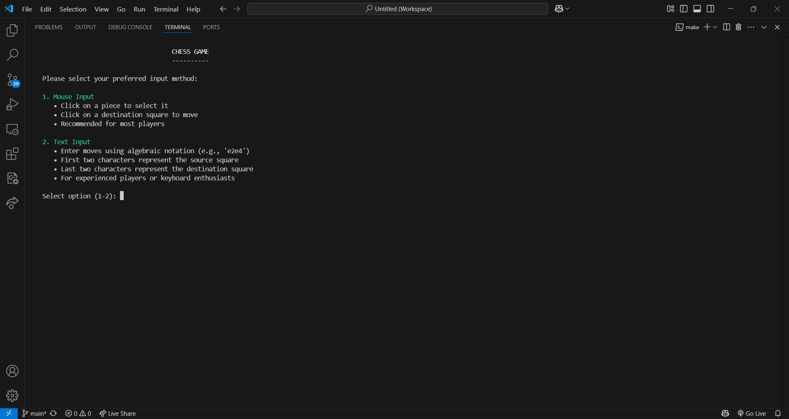
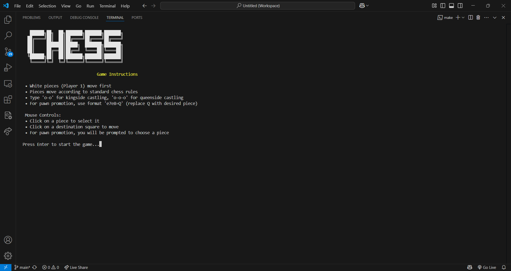
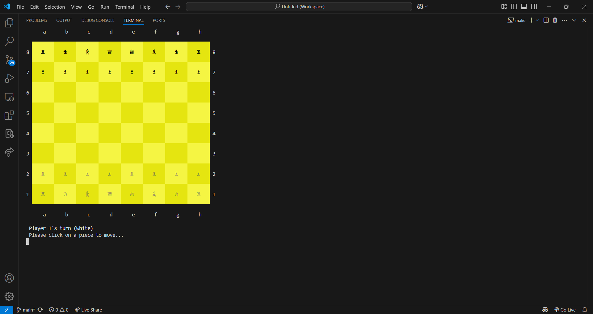

# Chess Game

A fully-featured chess game implementation in C++ with a console-based UI, mouse input support, and comprehensive rule enforcement.

## Screenshots

### Loading Screen


### Welcome Screen


### Game Instructions


### Chess Board


## Features

- Complete implementation of chess rules
- Two-player gameplay with both text and mouse input support
- Professional UI with Unicode chess symbols and colored board
- Special moves implementation:
  - Castling (kingside and queenside)
  - En passant captures
  - Pawn promotion
- Game state detection:
  - Check
  - Checkmate
  - Stalemate
  - Draw conditions (50-move rule, threefold repetition, insufficient material)
- Game history tracking
- Attractive welcome screen and interactive interface

## How to Play

The game supports two input methods:

### Mouse Input
- Click on a piece to select it
- Click on a destination square to move
- For pawn promotion, you will be prompted to choose a piece

### Text Input
- Enter moves in algebraic notation (e.g., 'e2e4')
- First two characters represent the starting position
- Last two characters represent the destination
- For castling, type 'o-o' (kingside) or 'o-o-o' (queenside)
- For pawn promotion, use format 'e7e8=Q' (replace Q with desired piece)

## How to Build

### Prerequisites
- C++ compiler with C++11 support
- Windows environment (uses Windows.h for console manipulation)

### Compilation
```bash
# To compile the code
make all

# To run the compiled program
make run

# To clean and rebuild
make clean
make all
```

## Project Structure

The project follows object-oriented design principles with separate classes for:
- Game logic (Game.cpp)
- Board representation (Board.cpp)
- Pieces with inheritance hierarchy (Piece.cpp, Pawn.cpp, etc.)
- Chess rules enforcement (ChessRules.cpp)
- Input handling (InputParser.cpp)

## Contributors

This project was developed by sophomore Computer Science students at FAST University Karachi:

- **Arsalan Tahir**
- **Wajiha Hassan**
- **Narmeen Zehra**

## License

This project is available for educational purposes.

## Acknowledgments

Special thanks to our instructors at FAST University for their guidance and support throughout the development of this project.
