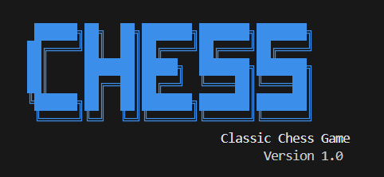
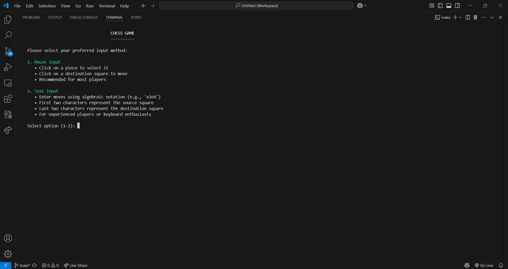
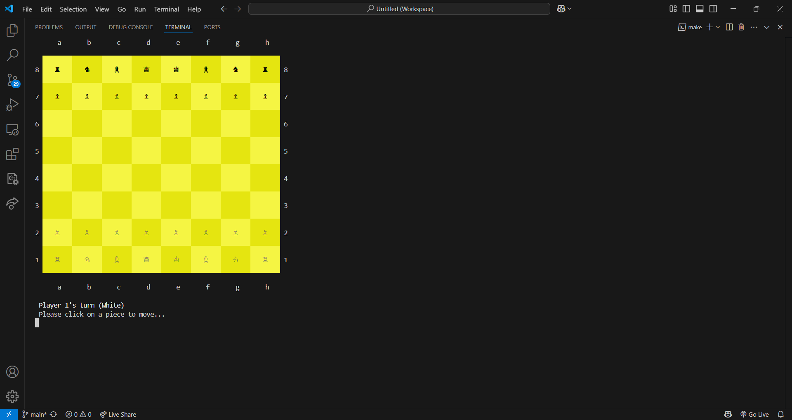

# Chess Game

A cross-platform chess game implementation in C++ featuring a clean architecture with separation of concerns.

## Screenshots

### Loading Screen


### Welcome Screen


### Game Instructions


### Chess Board


## Features

- Complete chess rules implementation
- Cross-platform compatibility (Windows and Unix-based systems)
- Mouse and keyboard input options
- Unicode chess piece symbols with color support
- Castling, en passant, and pawn promotion
- Check and checkmate detection
- Stalemate and draw detection
- Captured pieces tracking

## Architecture

The project follows a modular architecture with clear separation of concerns:

### Core Components

- **Game Logic**: Implements chess rules, move validation, and game state management
- **Board Representation**: Manages the chess board state and piece positions
- **Piece Hierarchy**: Object-oriented design for different chess pieces with polymorphic behavior
- **UI Abstraction**: Platform-independent UI layer that separates rendering from game logic

### Directory Structure

```
Chess/
├── include/              # Header files
│   ├── core/             # Core game logic headers
│   ├── pieces/           # Chess piece class headers
│   ├── utils/            # Utility and helper headers
│   └── ui/               # UI abstraction layer headers
├── src/                  # Implementation files
│   ├── core/             # Core game logic implementation
│   ├── pieces/           # Chess piece implementations
│   ├── utils/            # Utility implementations
│   └── ui/               # UI implementations
└── Makefile              # Build configuration
```

## Building and Running

### Prerequisites

- C++17 compatible compiler (GCC, Clang, or MSVC)
- Make build system

### Build Commands

Build the game:
```
make
```

Run the game:
```
make run
```

Clean build artifacts:
```
make clean
```

Show build information:
```
make os-info
```

Create directory structure (if needed):
```
make dirs
```

Display verbose compilation output:
```
make V=1
```

## Cross-Platform Support

The game is designed to work seamlessly on both Windows and Unix-based systems:

- **Windows**: Supports command prompt and PowerShell with Unicode chess symbols
- **Unix/Linux/macOS**: Supports terminal with ANSI color codes and Unicode

The codebase uses conditional compilation with platform-specific implementations:
- Console handling (`#ifdef _WIN32`)
- Color support
- Screen clearing
- Input handling

## How to Play

The game supports two input methods:

### Mouse Input
- Click on a piece to select it
- Click on a destination square to move

### Text Input
- Enter moves in algebraic notation (e.g., 'e2e4')
- Type 'o-o' for kingside castling
- Type 'o-o-o' for queenside castling
- For pawn promotion, use format 'e7e8=Q' (replace Q with desired piece)

## UI Abstraction Layer

The `ChessUI` class provides a clean abstraction between game logic and rendering:

- **Platform Independence**: Handles platform-specific console operations
- **Consistent Interface**: Provides a unified API for the game engine
- **Separation of Concerns**: Isolates UI code from game logic
- **Enhanced Maintainability**: Makes it easier to modify UI without affecting game rules

Key UI methods:
- Board rendering
- Message display
- Game state visualization
- Input handling

## Contributors

This project was developed by Computer Science students at FAST University Karachi:

- **Arsalan Tahir**
- **Wajiha Hassan**
- **Narmeen Zehra**

## License

This project is open source and available under the MIT License.

## Acknowledgments

Special thanks to our instructors at FAST University for their guidance and support throughout the development of this project.
